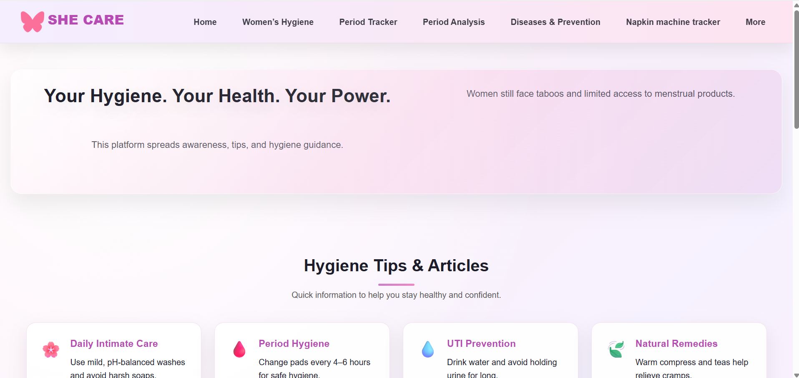
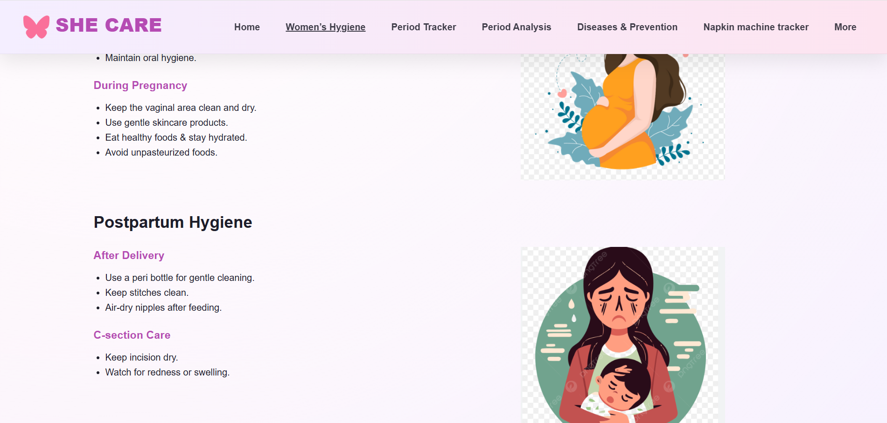
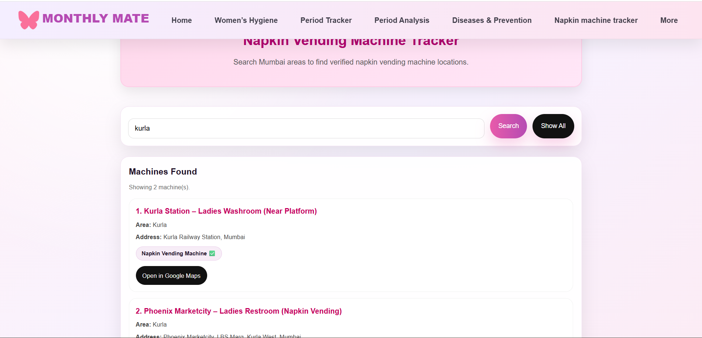
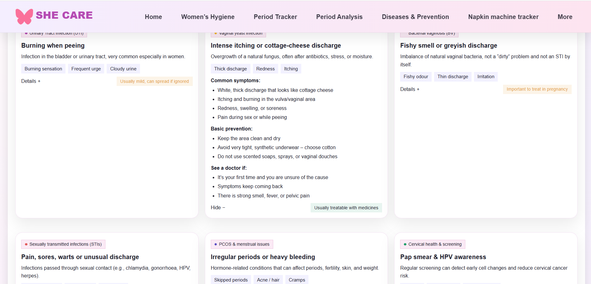
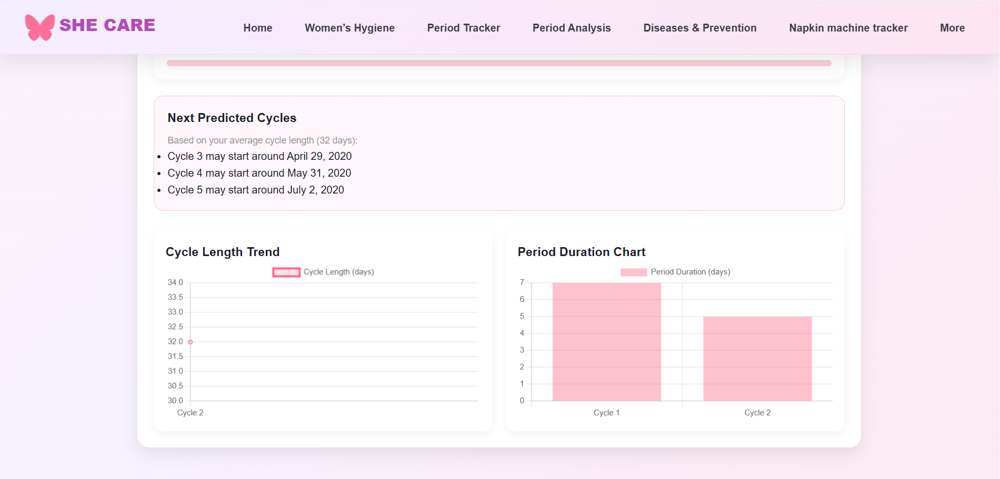
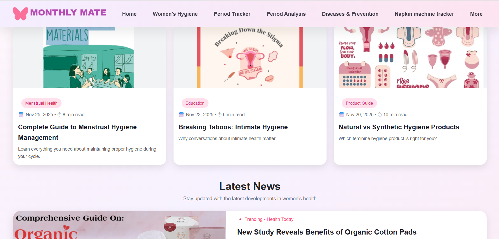
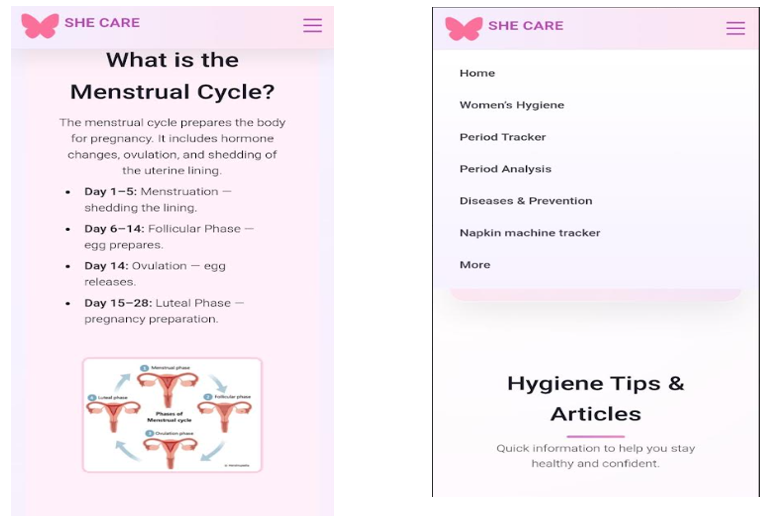
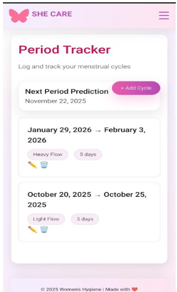
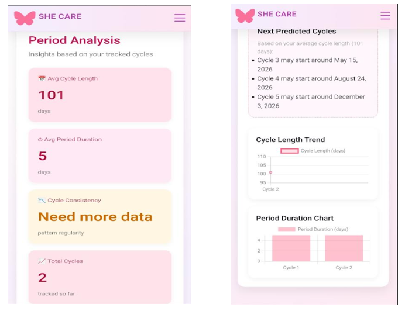

# SheCare – Women's Hygiene Awareness Platform

## About The Project
SheCare is an educational website created to spread awareness about women's hygiene and menstrual health.  
The platform provides information about menstrual hygiene, disease prevention, health analysis, and cycle tracking.  
The project was developed as a responsive website and later converted into an Android application using Applix to make the information more accessible on mobile devices.

## Features
- Women hygiene awareness section
- Napkin tracking feature
- Disease & prevention information
- Health analysis page
- Educational resources for menstrual health
- Mobile app version of the website

## Technologies Used
- HTML5
- CSS3
- JavaScript
- Applix (for converting website into Android app)

## Website Screenshots

### Homepage

### Women Hygiene Page

### Napkin Tracker

### Disease & Prevention

### Health Analysis

### More Information Page

## Android App
The SheCare website was converted into an Android application using Applix.

Download the app below:

[Download SheCare App](SheCare.apk)

## Few App Screenshots

### App Homepage

### Napkin Tracker (App)

### Period Analysis (App)

##  Learning Outcomes
- Creating an educational awareness website
- Designing responsive web pages
- Implementing JavaScript functionality
- Converting a website into a mobile application

##  Author
Developed by **Yashfin Khan**
